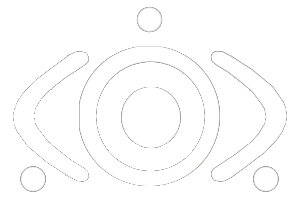

  
  <h1>Protocol 84</h1>
  
Our goal is to bring minds together to refine their thinking for a new world of computing.

 

  
  
  
  
  
  
  

 

  
   
  Help maintain the project by contributing an amount
  <h3>Monero</h3>
  43fCtXH6FCb92GX32GE414AXt1SEniPjHeNWDcFrFXkEScf1aPxkSt87qtSWYfAQeVbhwrtaaEecwfjANb7jswSBD7rypNw

 
 
 

  
   
   
  "You only exist through the memories of others, what is not remembered never happened. No matter where we go, we are all connected. There was no reason for me to stay in the real world anymore. In the real world, it didn't matter if I was there or not."

